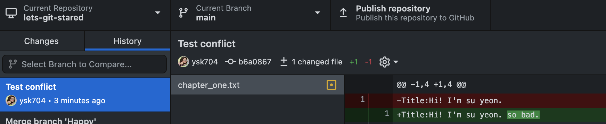
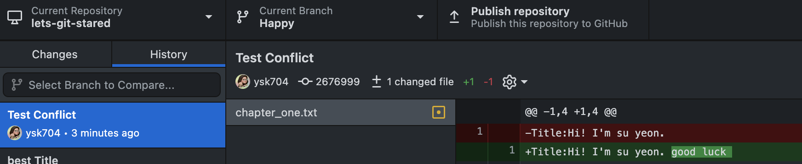
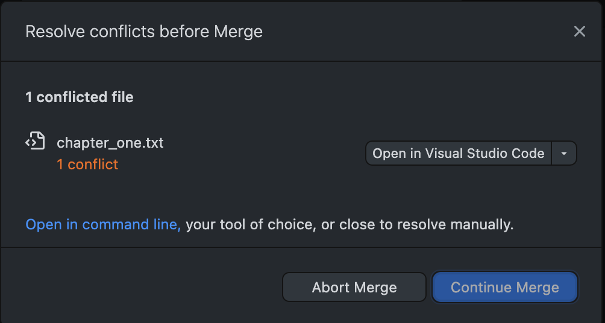
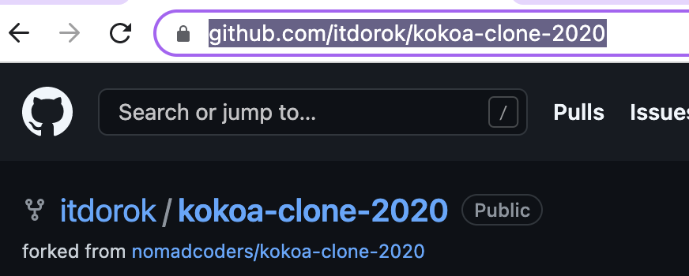
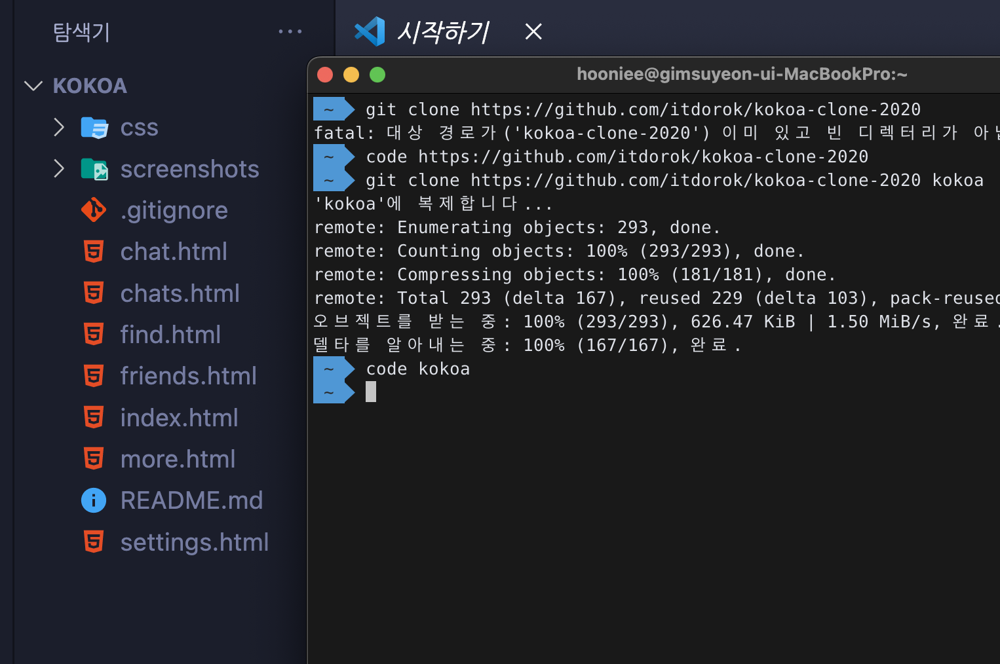

# **_💡 Basic Git concepts_**

## what is Git and GitHub?

```
Git: 버전 관리 시스템 (Version Control System)

GitHub: 깃 레포지토리 저장소 (cloud-based hosting service)
```

<br>

## repository

```
.git folder inside a project

tracking all changes made to files in project

if delete .git folder, you delete your project’s history.
```

<br>

## Commit

```
capturing a snapshot of the project's currently staged changes
```

<br>

## Areas

**_Working Area (untracked files)_**

```
local directory에서 존재
delete,edit,create 등의 활동이 일어나는 곳을 의미
이때 git은 이 파일을 tracking하지 않음
```

**_Staging Area (= index, cache)_**

```
다음 커밋에 포함될 파일이 있는 곳
git은 최근의 commit과 새로 commit될 파일 간의 차이를 tracking한다.
```

**_Repository_**

```
 commit된 파일의 snapshot을 가지고 있음
 working, staging area의 history를 알 수 있음
```

<br>

---

## Branches


> **`has seperate timeline`**

> **`has all the histories of a main brach`**

> **`update main branch's changes to the branch`**

> **`merge branches to main branch`**

<br>

---

## conflicts in Branches

<br>

### [Editing same line on two branches]




### [conflict occured]



you can’t continue merge unless solve the conflict

<br>

### [VScode]


> **`Solve conflicts` by choosing one option out of four**

<br>

# **_💡 Github_**

```
1. fork
2. cloning
3. pull request
```

---

<br>

## **_fork_**

```
다른 계정의 repository를 내 repository로 복사

단순히 다운로드 받으면 repository 생성 안됨
```



<br>

## **_cloning_**

```
forking한 repository를 local에 복제하는 것.
```

- terminal에서 clone하기
  <br>
  
  <br>
- git clone(생성된 repository 주소 (닉네임: kokoa))
- code kokoa (이때 code command 설정 필수)

<br>

## **_pull request_**

```
cloning한 파일을 github에 업로드 한 뒤 원본 repository에 merge 요청 하는 것
```

<br>

## **_upstream, origin_**

```
fork해온 베이스 저장소의 마스터 브랜치와 연결되어 있다.

base repository의 최신 수정 사항을 origin branch로 fetch 할 수 있다.
```


---

## **_CLI_**

```
Command Line Interface
```

```
1. log,commit,push
2. checkout and reset
3. hard/mixed/soft reset
4. checkout branches
5. commit --amend
6. ignoring files
7. origin
```

<br>

## **_git log_**

```
running record of commits.

현재 작업중인 branch나 원격저장소를 알 수 있다.
```

<br>

## **_reset / checkout_**

[checkout과 reset 설명 참조 👀](https://blog.naver.com/codeitofficial/222011693376)

```
reset
HEAD가 포인팅하는 브랜치가 가리키는 커밋을 바꾼다

checkout
HEAD가 브랜치에서 떨어져 나와
직접 다른 커밋/브랜치를 가리킨다
: detached branch
```

### 방법 1. id 이동 후 branch 만들기

```
git checkout (commit id)

git branch (branch's name)
: 원하는 커밋으로 돌아가서 브랜치 생성
```

### 방법 2. command로 한번에 생성

```
git checkout (commit id) -b (branch's name)

-b: 새로운 브랜치 생성 command
```

---

## **_reset 방법_**

```
hard : 변경사항 유지 안하고 돌아감
soft: 파일을 staging 단계에 둠
mixed : 파일을 untraked 영역에 둠
```

## **_checkout branches_**

```
현재 작업중인 브랜치를 바꿀 수 있음
```

## **_commit --amend_**

```
git add 변경한 파일
git commit --amend -m "" (혹은 --no-edit)
git push origin (branch's name) --force
```

--force

```
amend는 전 단계로 돌아감 : 현재 브랜치와 origin의 브랜치의 단계가 달라짐
reset/checkout처럼 강제 push 해야함
```

## **_ignore files_**

```
<.gitignore> 파일안에 숨기고 싶은 파일명을 적으면 파일이 보이지 않는다
```

## **_origin_**

```
git remote -v : 원격저장소 목록을 확인
git remote add (원격저장소 이름) <repo URL> : 원격저장소 추가
```
